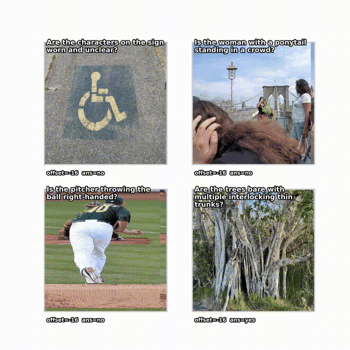

<h1 align="center">Questioning the Stability of Visual Question Answering</h1>
<p align="center">
    <strong>Authors:</strong> Amir Rosenfeld, Neta Glazer, Ethan Fetaya  
    <br>
    <a href="https://arxiv.org/abs/XXXX.XXXXX">📄 Paper</a> |
    <!-- <a href="https://your-project-page.com">🌐 Project Page</a> | -->
    <a href="#bibtex">📚 BibTeX</a>
</p>
<p align="center">
  
</p>

## 📄 Abstract
<div style="
  background: #f7f7f7;
  border-left: 4px solid #4b9cd3;
  padding: 1.1em 1.4em;
  border-radius: 4px;
  margin: 1.2em 0;
  line-height: 1.45;
">
Visual Language Models (VLMs) have achieved remarkable progress, yet their reliability under small, meaning-preserving input changes remains poorly understood. We present the first large-scale, systematic study of VLM robustness to benign visual and textual perturbations:  pixel-level shifts, light geometric transformations, padded rescaling, paraphrasing, and multilingual rewrites, that do not alter the underlying semantics of an image–question pair. Across a broad set of models and datasets, we find that modern VLMs are highly sensitive to such minor perturbations: a substantial fraction of samples change their predicted answer under at least one visual or textual modification. We characterize how this instability varies across perturbation types, question categories, and models, revealing that even state-of-the-art systems (e.g., GPT-4o, Gemini 2.0 Flash) frequently fail under shifts as small as a few pixels or harmless rephrasings. We further show that sample-level stability serves as a strong indicator of correctness: stable samples are consistently far more likely to be answered correctly. Leveraging this, we demonstrate that the stability patterns of small, accessible open-source models can be used to predict the correctness of much larger closed-source models with high precision. Our findings expose a fundamental fragility in current VLMs and highlight the need for robustness evaluations that go beyond adversarial perturbations, focusing instead on invariances that models should reliably uphold.
</div>

## 🔧 Code Availability
**Coming Soon**

---

## 📚 BibTeX  
(Will be updated upon publication.)  
```bibtex
@article{your2025robustvlm,
  title={Questioning the Stability of Visual Question Answering},
  author={Amir Rosenfeld and Neta Glazer and Ethan Fetaya},
  journal={arXiv preprint arXiv:XXXX.XXXXX},
  year={2025}
}
